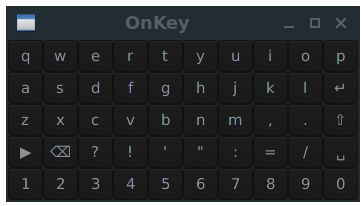

# OnKey
Lightweight on-screen keyboard in c and gtk2, optimized for portable devices.  
WARNING: This app will remap the keycode 249 to emulate unicode characters. Use `xmodmap -pke` to make sure it's unused.  
  
 *OnKey - Look from system theme*
## Features
- lightweight
- usable on small screens
- unicode
- relatively highly customizable
- small source code
- for Xorg
## Limitations
- doesn't support auto show / hide
- no spell check or word completition
## Install
Requires gtk2 dev and xlib.  
On Arch:  
`sudo pacman -S base-devel gtk2 xlib11`  
On Debian, Ubuntu:  
`sudo apt install build-essential libgtk2.0-dev libxtst-dev`  
To build and install use:  
`sudo make build clean install`  
To uninstall:  
`sudo make uninstall`  
To open and close the app you could use a small script like 'tkey', see the file.
## Options
-e   Expand the window width to match the screen width  
-k   Temporary set the system keyboard layout to 'us' while the app is open  
-w   The window width in pixels  
-h   The window height in pixels  
-o   Vertical offset. Adjust the window position, on the bottom of the screen. Can't be 0.  
-t   Loads your gtk 2 style file in your home, named '.ok.rc'  
-f   Shows flat buttons  
-p   Try to make the app visible on top of fullscreen applications  
-?   Help  
**Examples:**  
`onkey -e -h 500 -o 20 -t -f`  
`onkey -w 700 -h 300 -o 1 -k -p`
## About the keyboard layout
The keyboard layout should be 'us' because it target devices without a keyboard, where 'us' could be a 'standard'.
To have the application works correctly you can:  
\- set the system keyboard layout to 'us'
\- use the -k option
\- write a keys table for your layout
\- use unicode codes for all or part of the keys
## Style
You can customize colors and font using a gtk 2 style file in your home folder, see the -t option. Or use system theme.
## Known issues
\- The shift color and custom style doesn't work when using system theme.  
\- If you can't see unicode chars make sure you have a complete font, and the system locale set to utf8.  
## Make your keys table
To make your keys table, modify the variables in the "Variables to customize" section on top of the code. The keyboard UI is a grid so set the  number of columns, number of rows(per page) and number of pages setting **cn**, **nr** and **tp**.  
Then write the 2d array for all the "pages", called **keya**, and the array for the upper case letters (1 page) called **ukey**.  
Other variables you may want to change are the default vertical offset, **ofs**  (the height of the title bar to have the window on the bottom), and the height / width buttons ratio, **ra**.
KEYS SYNTAX:  
\- letter only: A letter, should be in your current system keyboard layout.  
codes:  
\- ^^^s space  
\- ^^^x backspace  
\- ^^^e enter  
\- ^^^p next page  
\- ^^^P prev page  
\- ^^^S shift / upcase  
\- ^^^u up  
\- ^^^d down  
\- ^^^l left  
\- ^^^r right  
\- ^^^t tab  
prefixes:  
\- ^^S shift+letter, to print up case letters.  
\- ^^s shift + symbols where the string match keysim  
\- ^^n symbols where the string match keysim  
\- U U + 4 digit hexadecimal unicode code

More about xlib conversion: https://cgit.freedesktop.org/xorg/proto/x11proto/tree/keysymdef.h
